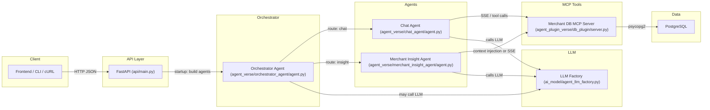
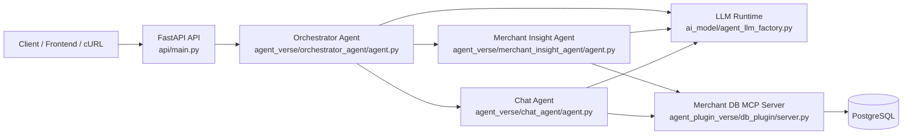

# SalesCoach AI — Multi-Agent Sales Coaching Platform

AI-powered field-sales decision support for merchant-facing teams.

<!-- Badges (styled like the example you provided) -->


---

## 1. Architecture — Invocation, Links and Call Flow

The diagram below shows how requests flow through the system and which components call which tools / services. Use this for both documentation and as a basis for an interview whiteboard explanation.



Key invocation notes:

- `api/main.py` constructs the agents at app startup and exposes HTTP endpoints.
- The Orchestrator accepts a request and classifies intent (navigation / chat / insight).
- For chat, the Chat Agent may call the Merchant DB MCP tools (SSE) for structured data and the LLM for natural-language reasoning.
- For insight, the Merchant Insight Agent composes SQL context (Context Injection) or calls MCP tools and then calls the LLM to produce the human-readable brief.
- The MCP server enforces RBAC (`user_id` + `user_role`) and returns only scoped rows to agents.

How the links are connected (implementation paths):

- API startup: `api/main.py` -> constructs `ChatAgent().get_agent()` and `MerchantInsightAgent().get_agent()` and wires them into the `OrchestratorAgent().build()` flow.
- Chat agent plugin: `agent_verse/chat_agent/agent.py` -> `MCPSsePlugin(name="merchant_db", url=plugin_config['sse_server_url'])` -> attached to the agent's `Kernel` as a plugin.
- MCP server entry point: `agent_plugin_verse/db_plugin/server.py` -> defines `mcp.tool()` functions like `get_merchant_details`, `get_merchant_score`, `search_data`, etc.
- LLM wiring: `ai_model/agent_llm_factory.py` -> `get_chat_completion()` returns the Semantic Kernel chat service used by agents.

---
## Overview

SalesCoach AI helps sales teams understand merchant performance, retrieve contextual insights, and ask grounded questions over business data. The platform is designed around three technical pillars:

- Multi-agent orchestration for intent routing and specialized execution
- Tool-augmented reasoning through the Merchant DB MCP server
- Secure, role-aware access control enforced before data is returned

### Key Capabilities

| Capability | Description |
|---|---|
| Multi-agent orchestration | A central orchestrator classifies user intent and routes requests to the correct sub-agent. |
| Merchant insight generation | Produces profile, score, recommendation, or pre-visit brief summaries for a merchant. |
| Conversational coaching | Supports open-ended questions grounded in merchant and activity data via the Chat Agent. |
| RBAC-enforced data access | Every merchant DB tool validates the caller's role and scopes results to the caller's access domain. |
| Provider-agnostic LLM loading | The LLM factory abstracts model construction through a JSON configuration model and environment-backed secrets. |

---
# SalesCoach AI � Multi-Agent Sales Coaching Platform

SalesCoach AI is a modular, production-oriented backend for AI-assisted field sales operations. It combines a FastAPI application, Semantic Kernel agents, an MCP-based merchant database server, and role-aware data access to support merchant insight generation, conversational coaching, and operational workflows.

> This repository reflects a multi-agent architecture rather than a single-agent MVP. The system routes requests through an orchestrator, uses specialized sub-agents, and enforces data access rules in the MCP layer.

---

## Overview

SalesCoach AI helps sales teams understand merchant performance, retrieve contextual insights, and ask grounded questions over business data. The platform is designed around three technical pillars:

- Multi-agent orchestration for intent routing and specialized execution
- Tool-augmented reasoning through the Merchant DB MCP server
- Secure, role-aware access control enforced before data is returned

### Key Capabilities

| Capability | Description |
|---|---|
| Multi-agent orchestration | A central orchestrator classifies user intent and routes requests to the correct sub-agent. |
| Merchant insight generation | Produces profile, score, recommendation, or pre-visit brief summaries for a merchant. |
| Conversational coaching | Supports open-ended questions grounded in merchant and activity data via the Chat Agent. |
| RBAC-enforced data access | Every merchant DB tool validates the caller's role and scopes results to the caller's access domain. |
| Provider-agnostic LLM loading | The LLM factory abstracts model construction through a JSON configuration model and environment-backed secrets. |

---

## Architecture

The system is composed of four layers:

1. API layer � FastAPI routers expose business endpoints.
2. Agent layer � Semantic Kernel agents interpret requests and orchestrate reasoning.
3. Tool layer � MCP server exposes structured merchant database tools.
4. Data layer � PostgreSQL stores merchant, user, signal, recommendation, and audit data.



### Runtime Flow

- Incoming requests hit the FastAPI application in api/main.py.
- The application builds the orchestrator and its two sub-agents once during startup.
- The orchestrator analyzes the request and chooses between navigation, merchant insight, or chat behavior.
- The sub-agents interact with the Merchant DB MCP server through tool calls that are scoped by role and ownership.
- The MCP server executes SQL against PostgreSQL and returns only authorized data.

### Architectural Components

| Layer | Path | Responsibility |
|---|---|---|
| API | api/main.py | Builds the FastAPI app, registers routers, and wires the agents into app lifecycle. |
| Routers | api/routers | Exposes auth, dashboard, merchant, recommendation, chat, manager, and admin endpoints. |
| Orchestrator | agent_verse/orchestrator_agent/agent.py | Routes requests to the correct downstream agent and validates user role. |
| Chat Agent | agent_verse/chat_agent/agent.py | Answers conversational questions using MCP-backed merchant data. |
| Merchant Insight Agent | agent_verse/merchant_insight_agent/agent.py | Produces merchant profile, score, recommendation, and brief-style summaries. |
| LLM Factory | ai_model/agent_llm_factory.py | Loads LLM configuration and instantiates the appropriate chat completion backend. |
| MCP Server | agent_plugin_verse/db_plugin/server.py | Exposes authorized database tools over SSE for agent use. |
| Data Access | api/database.py | Provides PostgreSQL connectivity for the API layer. |
| Seed + DB Setup | db/setup_and_seed.py | Creates schema and populates synthetic data for local development. |

---

## Design Principles

- Modular agent composition � each agent has a focused concern and the orchestrator handles delegation.
- Tool-first grounding � the Chat and Insight agents use structured tools instead of relying only on raw model memory.
- RBAC at the data boundary � the MCP server is the enforcement point for role-aware access.
- Environment-driven configuration � secrets and runtime settings are expected from environment variables.
- Provider abstraction � the LLM factory supports multiple backends through the same interface.

---

## Project Structure

```text
sales_coach_agent/
+-- api/
�   +-- main.py
�   +-- database.py
�   +-- dependencies.py
�   +-- routers/
�       +-- admin.py
�       +-- auth.py
�       +-- chat.py
�       +-- dashboard.py
�       +-- manager.py
�       +-- merchants.py
�       +-- recommendations.py
�       +-- __init__.py
+-- agent_verse/
�   +-- chat_agent/
�   �   +-- agent.py
�   �   +-- prompt/
�   +-- merchant_insight_agent/
�   �   +-- agent.py
�   �   +-- prompt/
�   +-- orchestrator_agent/
�       +-- agent.py
�       +-- prompt/
+-- agent_plugin_verse/
�   +-- db_plugin/
�       +-- server.py
+-- ai_model/
�   +-- agent_llm_factory.py
+-- config/
�   +-- credential_manager.py
�   +-- llm_config.json
�   +-- plugin_config.json
+-- db/
�   +-- daily_reprofiling.py
�   +-- setup_and_seed.py
+-- utils/
�   +-- logger.py
�   +-- metrices.py
+-- requirements.txt
+-- README.md
```

---

## Prerequisites

- Python 3.11+
- PostgreSQL database reachable from the local environment
- A valid LLM provider API key (the current implementation is configured for Groq-compatible endpoints)
- Network access to the configured LLM endpoint

---

## Quick Start

### 1. Create a virtual environment

```powershell
python -m venv .venv
.\.venv\Scripts\Activate.ps1
```

### 2. Install dependencies

```powershell
.\.venv\Scripts\python.exe -m pip install -r requirements.txt
```

### 3. Configure environment variables

Create a `.env` file in the project root with at least:

```env
DATABASE_URL=postgresql://<user>:<password>@<host>:<port>/<db>
GROQ_API_KEY=your_groq_api_key
LLM_CONFIG_FILE=config/llm_config.json
PLUGINS_CONFIG_FILE=config/plugin_config.json
AGENT_LLM_MODEL=groq_llama_3_3_70b
```

### 4. Seed the database

```powershell
.\.venv\Scripts\python.exe db\setup_and_seed.py
```

This creates the schema and populates synthetic merchant, user, recommendation, and visit-history data.

### 5. Start the MCP server

```powershell
.\.venv\Scripts\python.exe -m agent_plugin_verse.db_plugin.server
```

The MCP server listens on port 9002 by default.

### 6. Start the API server

```powershell
.\.venv\Scripts\python.exe -m uvicorn api.main:app --host 0.0.0.0 --port 8080
```

Open the docs at:

- http://localhost:8080/docs
- http://localhost:8080/health

---

## Agent Reference

| Agent | Primary Path | Purpose |
|---|---|---|
| Orchestrator Agent | agent_verse/orchestrator_agent/agent.py | Classifies intent, validates role, and routes to the proper sub-agent. |
| Chat Agent | agent_verse/chat_agent/agent.py | Answers grounded sales questions using the merchant database tools. |
| Merchant Insight Agent | agent_verse/merchant_insight_agent/agent.py | Produces merchant-specific insight summaries and briefs. |

---

## MCP Tools Reference

The Merchant DB MCP server in agent_plugin_verse/db_plugin/server.py exposes role-scoped database tools. All tools require a user identity and role and enforce access restrictions before returning data.

| Tool | Description |
|---|---|
| get_merchant_details | Returns merchant profile data for the caller's allowed scope. |
| get_merchant_score | Returns daily score, ranking, and signal information. |
| get_merchant_recommendations | Returns recommendations tied to the merchant. |
| get_merchant_visit_history | Returns recent visit history for the merchant. |
| update_action | Updates recommendation status for an allowed DSP-owned merchant. |
| search_data | Supports broader data search scenarios for the Chat Agent. |
| get_audit | Returns administrative audit records when permitted. |

---

## Prompt System

Prompt templates live under the agent-specific prompt directories:

- agent_verse/chat_agent/prompt
- agent_verse/merchant_insight_agent/prompt
- agent_verse/orchestrator_agent/prompt

The prompt factory loads text templates from these folders to keep agent instructions modular and maintainable.

---

## Configuration Reference

| Setting | Path | Purpose |
|---|---|---|
| DATABASE_URL | .env | PostgreSQL connection string for the API and MCP server. |
| GROQ_API_KEY | .env | Credentials for the Groq-compatible LLM endpoint. |
| AGENT_LLM_MODEL | .env | Defaults the selected LLM model. |
| LLM_CONFIG_FILE | .env | Points to config/llm_config.json. |
| PLUGINS_CONFIG_FILE | .env | Points to config/plugin_config.json. |

---

## API Surface

The FastAPI layer exposes a broad set of routers under api/routers:

- Auth routes for login and token handling
- Dashboard routes for summary data
- Merchant routes for profile and insight retrieval
- Recommendation routes for action updates
- Chat routes for conversational interactions
- Manager and admin routes for team and governance workflows

Example requests:

```powershell
curl http://localhost:8080/health
```

```powershell
curl -X POST http://localhost:8080/api/v1/chat `
  -H "Content-Type: application/json" `
  -d '{"message":"Which merchants need attention most today?"}'
```

---

## Security and Secrets

- Secrets should be stored in environment variables and never committed into source control.
- The MCP server reads the database URL from DATABASE_URL and does not rely on embedded credentials.
- Role-based access is enforced in the MCP layer before any merchant data is returned.
- The repository ignores local environment files and other runtime artifacts.

---

## Dependencies

The implementation relies on:

- FastAPI for the REST API layer
- Semantic Kernel for agent orchestration and tool integration
- OpenAI-compatible client libraries for LLM access
- psycopg2 for PostgreSQL connectivity
- python-dotenv for environment loading
- MCP/FastMCP for the merchant database tool server

---

## License

This project is intended for internal and experimental use. Update the license header or repository policy if you plan to distribute it externally.
